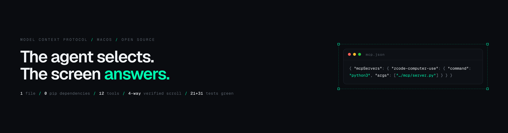
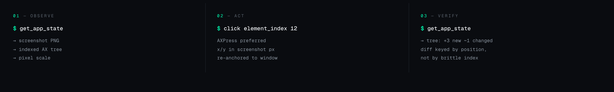
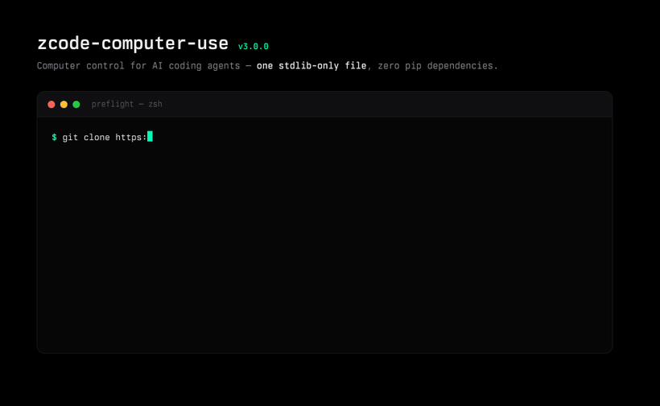
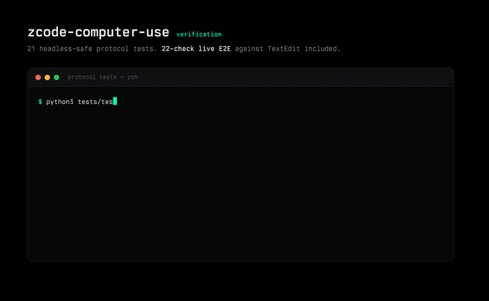
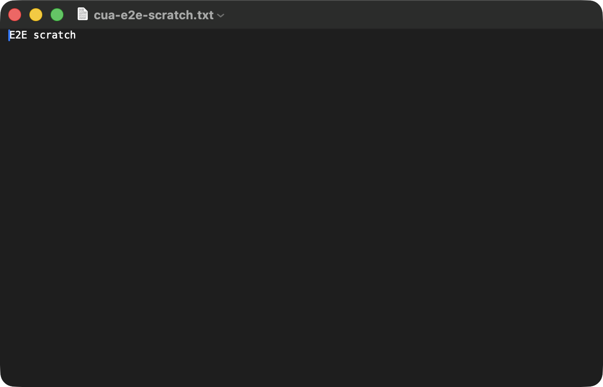
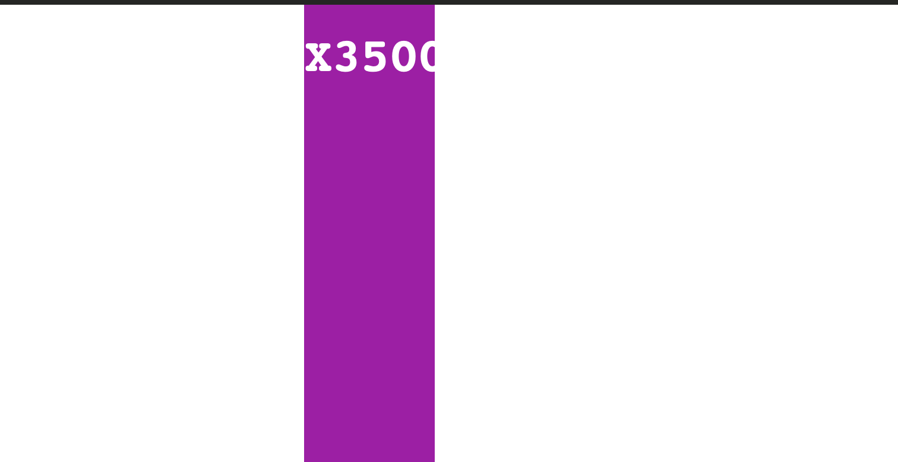

<div align="center">
  
</div>

# zcode-computer-use

**Computer control for AI coding agents — screenshots + an accessibility tree, in one stdlib-only Python file.**

    

An MCP server that gives an agent eyes and hands on native macOS apps: a per-window screenshot plus an indexed accessibility tree, element-first actions with screenshot-pixel fallback. No pip installs, no build step, no daemon — one readable file you can audit in an afternoon and hack on the same evening.

Observe → act → verify, with diff markers: after every action the tree is marked stale, and the next `get_app_state` shows exactly which elements your action added or changed (`[+n]` / `[~n]`, keyed by tree position so index shifts don't fool you). The agent stops re-reading whole windows to learn what one click did.

<div align="center"></div>

## Demo

Preflight and verification (GIFs rendered with [cinta](https://github.com/sainzs/cinta)):




Real frames from the E2E suite while verifying 4-way scroll (Safari, no mouse touch — pure synthetic wheel events):

| before | after `scroll right 2 pages` |
|---|---|
|  |  |

The scroll path is the part most desktop-automation repos don't test — and the part most likely to silently not work: wheel events posted to macOS's HID event tap are **dropped without error**. This server posts pixel-unit events to the session tap via Apple's bundled Python (pyobjc) and ships the evidence in the test suite.

## Install

Copy-paste into your client's MCP config (ZCode, Claude Code, Cursor, any MCP host):

```json
{
  "mcpServers": {
    "zcode-computer-use": {
      "command": "python3",
      "args": ["/absolute/path/to/zcode-computer-use/mcp/server.py"],
      "env": { "PYTHONUNBUFFERED": "1" }
    }
  }
}
```

Or clone and check your machine is ready:

```bash
git clone https://github.com/sainzs/zcode-computer-use
python3 zcode-computer-use/mcp/server.py selftest   # names the exact missing permission
python3 zcode-computer-use/tests/test_protocol.py   # 21 headless-safe protocol tests
```

**Permissions (the one hurdle):** the host app (ZCode, Claude Desktop, your terminal) needs **Accessibility** + **Screen Recording** in System Settings → Privacy & Security, then a restart. `selftest` tells you which one is missing.

## Quickstart: see → click → done

```text
get_app_state {"app": "TextEdit"}
  → screenshot: ~/.cache/…/state-000001.png  ·  pixel_scale 2.0
  → tree: 12 elements — [3] AXTextArea "…", [8] AXButton "Save" …

click {"element_index": 3}
type_text {"text": "hello from the agent"}
select_text {"element_index": 3, "start": 0, "length": 5}
  → {"selected_text": "hello", "method": "keyboard"}   # verified, not trusted
```

Element targets are preferred (`AXPress` is robust); `x`/`y` coordinates are in **screenshot pixels** and are rescaled and re-anchored to the captured window automatically. Errors come back as structured JSON — `{"error": {"code": "stale_state", "message": "…", "remedy": "call get_app_state again"}}` — so the agent can branch instead of parsing prose.

## What it refuses

The reject list is a design document. This server will not:

- **steal focus to observe** — `activate:false` reads background windows without raising them; activation is opt-in per call
- **launch apps silently** — a non-running app is an `app_not_found` error unless you pass `launch:true`
- **trust its own memory of the UI** — element indexes die with the tree that produced them (forced re-fetch, anti-forgery address chains)
- **return prose errors** — every failure is structured `{code, message, remedy}` JSON
- **phone home, ever** — no telemetry, no network calls, no accounts
- **grow a dependency graph** — one stdlib-only file; scroll shells to Apple's bundled `/usr/bin/python3`, nothing pip-installed

## Why this over heavier desktop-automation servers

| | zcode-computer-use | typical alternative |
|---|---|---|
| Install surface | one `.py`, zero pip deps | runtime + package graph |
| Auditability | read the whole driver in ~1,800 lines | trust the bundle |
| Tree hygiene | forced re-fetch, anti-forgery, diff markers | varies |
| Errors | structured `{code, message, remedy}` | prose strings |
| Focus | background observe never steals focus | usually activates |
| Scroll | 4-way, verified, session-tap recipe documented | often vertical-only, unverified |
| Text selection | content-verified with keyboard fallback | rare |
| Tests | 21 protocol + 31-check live E2E you can run | — |

The pitch isn't more features — it's that the whole driving stack (System Events, cliclick, screencapture, CGWindowList, CGEventPost) fits in a single auditable file with its hard-won traps written down: `CFRelease` segfaults in JXA, HID-tap wheel-event drops, apps that silently ignore scripted selection writes. If you want to *learn* how computer control works — or fork it into your own driver — start here.

## Tool surface

12 tools: `list_apps`, `list_windows`, `get_app_state` (per-window, depth-bounded, background-capable), `click`, `type_text` (clipboard-paste or raw keystrokes), `press_key`, `scroll` (4-way), `drag`, `set_value`, `select_text`, `element_info`, `perform_action`. The tool descriptions in `mcp/server.py` are the manual — and they are honest about app-specific limits.

## Verification

```bash
python3 tests/test_protocol.py    # 21 golden protocol tests, headless-safe
python3 tests/e2e_textedit.py     # 31-check live drive of TextEdit
python3 mcp/server.py selftest    # deps + permissions preflight
```

## Known limits

- macOS only (System Events / CGWindowList / cliclick stack).
- The frontmost window is the default target; huge AX trees are bounded by `depth` (0–12) and a 350-element cap.
- `select_text` keyboard fallback caps at 400 characters.
- Without Screen Recording you get a full-screen capture with approximate multi-display coordinates.
- Scroll needs Apple's bundled `/usr/bin/python3` (pyobjc); Homebrew-only setups get a structured `unsupported` error.

## License

MIT — see [LICENSE](LICENSE). Issues and PRs welcome.

*Docs GIFs rendered with [cinta](https://github.com/sainzs/cinta) — animated terminal captures for documentation. Built with ZCode on GLM.*
